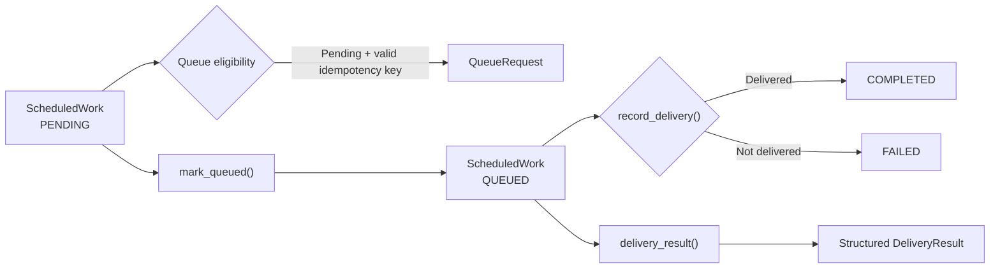

# Nudge

### Reliable Workflow Contracts for Scheduled and Queue-Driven Systems

Nudge is a focused systems-engineering showcase demonstrating how scheduled work can move through explicit, validated lifecycle states before infrastructure-specific schedulers, queues, workers, persistence, and notification adapters are introduced.

The public repository concentrates on a small but important reliability boundary:

**scheduled work → queue eligibility → controlled state transition → delivery outcome**

---

## Problem

Background and scheduled workflows become difficult to reason about when state transitions, queue eligibility, delivery results, and duplicate execution rules are spread across infrastructure-specific code.

A reliable workflow needs clear answers to questions such as:

- Is this work actually eligible to enter the queue?
- Has an idempotency key been supplied?
- Can completed work accidentally be queued again?
- Can delivery be recorded before work reaches the queued state?
- How should successful and failed delivery outcomes change workflow state?
- Can workflow results be represented through structured contracts rather than loosely coupled values?

Nudge isolates those concerns into small, deterministic workflow contracts that can be tested independently from the eventual scheduler, queue technology, persistence layer, and notification provider.

---

## What the System Demonstrates

The current public showcase models scheduled work using explicit contracts and lifecycle states.

A unit of work begins in `PENDING`.

Eligible work can produce a queue request and transition to `QUEUED`.

A delivery outcome then transitions the work to either `COMPLETED` or `FAILED`.

The implementation validates these transitions instead of allowing arbitrary state changes.

---

## System Architecture



The public repository intentionally focuses on the workflow-contract layer.

```text
Scheduler / Trigger
        │
        ▼
  ScheduledWork
        │
        ▼
 Eligibility Rules
        │
        ▼
   Queue Contract
        │
        ▼
 State Transition
        │
        ▼
 Delivery Outcome
```

Infrastructure-specific implementations such as a production scheduler, queue worker, persistence store, retry engine, locking strategy, or notification provider are outside the current public showcase.

---

## Implemented Capabilities

### Scheduled Work Contract

`ScheduledWork` defines:

- work identifier
- scheduled execution time
- idempotency key
- current workflow status

The object is implemented as an immutable Python dataclass.

### Explicit Workflow States

The lifecycle is represented through the `WorkStatus` enum:

```text
PENDING
QUEUED
COMPLETED
FAILED
```

Using explicit states makes workflow behavior easier to validate and test.

### Queue Eligibility Validation

`build_queue_request()` allows a queue request to be produced only when:

1. the work is currently `PENDING`
2. a non-empty idempotency key is present

Invalid transitions raise an error rather than silently changing workflow state.

### Queue State Transition

`mark_queued()` performs the controlled transition:

```text
PENDING → QUEUED
```

Work in another state cannot be queued through this contract.

### Delivery State Transition

`record_delivery()` requires work to already be in the `QUEUED` state.

A successful delivery produces:

```text
QUEUED → COMPLETED
```

A failed delivery produces:

```text
QUEUED → FAILED
```

Delivery details are required before an outcome is accepted.

### Structured Delivery Result

`delivery_result()` produces a typed `DeliveryResult` containing:

- work ID
- delivery success/failure
- normalized delivery detail

This keeps workflow results explicit and structured.

---

## Reliability Model

| Concern | Current Contract |
|---|---|
| Queue eligibility | Only `PENDING` work can produce a queue request |
| Duplicate-execution foundation | Queue requests require an idempotency key |
| Controlled state changes | Invalid state transitions raise errors |
| Delivery ordering | Delivery can only be recorded after work is `QUEUED` |
| Successful execution | `QUEUED → COMPLETED` |
| Failed execution | `QUEUED → FAILED` |
| Structured outcomes | Delivery results use a typed contract |
| Deterministic behavior | Workflow rules are independent of infrastructure adapters |

The repository establishes the contracts needed for reliable asynchronous workflows without claiming that the complete distributed runtime is implemented here.

---

## Technology Stack

- **Python 3.11**
- **Python dataclasses**
- **Python Enum**
- **pytest**
- **GitHub Actions**
- **Git**

The current public showcase intentionally has minimal dependencies so the workflow rules can be tested independently from infrastructure technology.

---

## How It Works

1. Define a `ScheduledWork` item with identity, target execution time, idempotency key, and state.
2. `build_queue_request()` validates queue eligibility.
3. `mark_queued()` transitions eligible work from `PENDING` to `QUEUED`.
4. `record_delivery()` records `COMPLETED` or `FAILED`.
5. `delivery_result()` returns a structured result.

---

## Testing

The public showcase includes automated pytest coverage for the workflow contracts.

Current tests verify:

- pending work can build a queue request
- queue requests require an idempotency key
- non-pending work cannot be queued
- pending work transitions to queued
- successful delivery transitions queued work to completed
- failed delivery transitions queued work to failed
- delivery cannot be recorded before the queued state
- delivery results are returned through a structured contract

Run the test suite with:

```bash
python3 -m pytest -q
```

---

## Continuous Integration

GitHub Actions runs the validation suite on pushes and pull requests to `main`.

The CI workflow performs:

```text
Checkout
   ↓
Python 3.11 setup
   ↓
Install dependencies
   ↓
pip check
   ↓
Compile showcase + tests
   ↓
pytest
```

---

## Repository Structure

```text
.
├── .github/
│   └── workflows/
│       └── ci.yml
├── showcase/
│   ├── __init__.py
│   └── workflow_contracts.py
├── tests/
│   ├── __init__.py
│   └── test_workflow_contracts.py
├── pytest.ini
└── requirements.txt
```

---

## Running Locally

```bash
python3 -m venv .venv
source .venv/bin/activate
pip install -r requirements.txt
python3 -m pytest -q
```

---

## Why This Project Matters

Nudge complements the AI-heavy projects in this portfolio by focusing on a different engineering problem:

> **How do we make asynchronous workflows predictable, explicit, and testable?**

Reliable AI and software systems often depend on background execution for scheduled processing, asynchronous jobs, notifications, document pipelines, evaluation, external API workflows, and long-running operations.

Those systems need more than a queue library. They need clear lifecycle rules, idempotency boundaries, controlled transitions, failure handling, and testable contracts.

This repository isolates that engineering foundation.

---

## Current Scope

The public repository currently demonstrates the workflow-contract and lifecycle-validation layer.

It does **not** currently implement or claim:

- a production scheduler
- Redis
- RQ, Celery, or another queue runtime
- a background worker process
- PostgreSQL persistence
- distributed locking
- retry/backoff execution
- notification-provider integration
- trusted-contact delivery
- FastAPI endpoints
- authentication
- a Next.js frontend
- Docker-based deployment

Those technologies should only be added to the implemented-capabilities section when corresponding public code exists.

---

## Roadmap

Potential extensions include:

- **Scheduling:** identify eligible work based on `scheduled_for`.
- **Durable persistence:** store workflow state and execution history in a database-backed repository.
- **Queue and worker runtime:** connect the queue contract to a background job system.
- **Idempotent processing:** extend the idempotency-key contract with durable duplicate-execution protection.
- **Retry and failure policy:** add retry limits, timing, terminal-failure behavior, and execution history.
- **Notification delivery:** introduce delivery adapters for application notifications and trusted-contact workflows.
- **API/application layer:** expose workflow management through an authenticated backend and, where useful, a user-facing application.

These are roadmap directions and are **not claimed as implemented in the current public repository**.

---

## Important Note

This repository is a scoped engineering showcase designed to demonstrate workflow contracts, lifecycle validation, and reliability-oriented software design.

It does not claim to be a complete production scheduling, messaging, or notification platform.

---

## Portfolio Context

Nudge is part of a broader Applied AI and software-engineering portfolio covering Generative AI, RAG, Agentic AI, AI platform engineering, governed AI, backend/API engineering, full-stack product development, and reliability-oriented systems.

**GitHub:** [chaitanyaAI-careers](https://github.com/chaitanyaAI-careers)  
**LinkedIn:** [linkedin.com/in/chaitanyaai-careers](https://www.linkedin.com/in/chaitanyaai-careers/)
